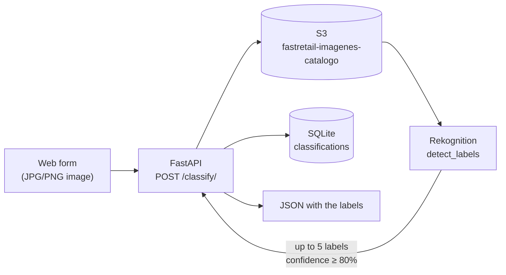

# FastRetail — Automatic catalog image tagging with AWS Rekognition

Web service for a retail store: the user uploads a photo of a product, it is stored in
S3, Amazon Rekognition analyzes it and returns the labels it detected, which are
recorded for the catalog.

Project from the **Specialization Course in Artificial Intelligence and Big Data**.

## Flow



## Technical decisions

- **Rekognition reads from S3, not from the request body.** That way the image ends up
  stored as part of the catalog and the analysis doesn't depend on the upload size.
- **Minimum confidence of 80%.** Rekognition returns plenty of low-confidence labels;
  for a catalog, fewer and better is what counts.
- **No credentials in the code.** `boto3` takes them from the environment or from the
  AWS profile configured on the machine.

## Running it

Requires an AWS account with credentials configured (`aws configure` or environment
variables) and a bucket named `fastretail-imagenes-catalogo` in `us-east-1`.

```bash
pip install fastapi uvicorn boto3 python-multipart
uvicorn clasificador_productos:app --reload
```

Open `http://127.0.0.1:8000` and upload an image. The `fastretail.db` database is
created on its own the first time.

## Stack

Python · FastAPI · AWS S3 · AWS Rekognition · SQLite
