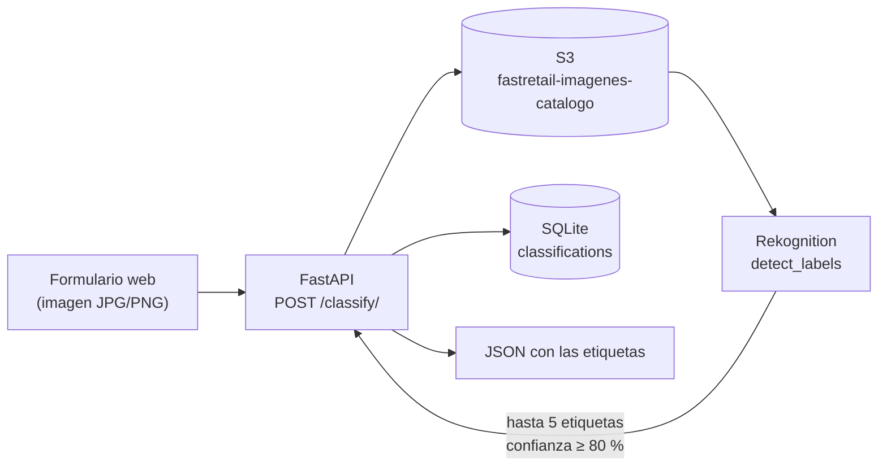

# FastRetail — Etiquetado automático de imágenes de catálogo con AWS Rekognition

Servicio web para un comercio: el usuario sube la foto de un producto, se guarda en
S3, Amazon Rekognition la analiza y devuelve las etiquetas detectadas, que quedan
registradas para el catálogo.

Proyecto del **Curso de Especialización en Inteligencia Artificial y Big Data**.

## Flujo



## Decisiones técnicas

- **Rekognition lee desde S3, no desde el cuerpo de la petición.** Así la imagen queda
  almacenada como parte del catálogo y el análisis no depende del tamaño del upload.
- **Confianza mínima del 80 %.** Rekognition devuelve muchas etiquetas de baja
  confianza; para un catálogo interesa poco y bueno.
- **Sin credenciales en el código.** `boto3` las toma del entorno o del perfil de AWS
  configurado en la máquina.

## Ejecución

Requiere una cuenta de AWS con credenciales configuradas (`aws configure` o variables
de entorno) y un bucket llamado `fastretail-imagenes-catalogo` en `us-east-1`.

```bash
pip install fastapi uvicorn boto3 python-multipart
uvicorn clasificador_productos:app --reload
```

Abre `http://127.0.0.1:8000` y sube una imagen. La base de datos `fastretail.db` se
crea sola la primera vez.

## Stack

Python · FastAPI · AWS S3 · AWS Rekognition · SQLite
